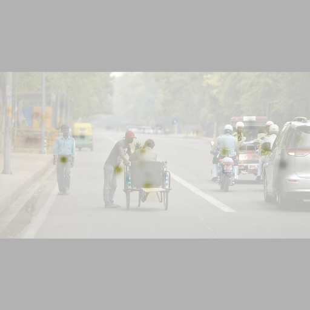

# 'RCNet'(Refine-CornerNet)
This is object detection project.　　 
Contact: [mikegao0415@gmail.com](mailto:mikegao0415@gmail.com). Any questions or discussions are welcomed! 

## Abstract
In object detection, keypoint-based approacheseliminate the need for designing a set of anchor boxes andachieved state-of-the-art accuracy of one-stage approaches.However, it often suffer unable trade-offs inference time andaccuracy, arguably due to the complexity of network frame-works. In this paper, we tackle the problem of keypoint-basedobject detection and introduce RCNet. We detect one key-point (center point), rather than a pair, which lead to improveeffectiveness in inference. In further, we redesigned key-point estimation network for stack hourglass network, namedRefine-hourglass. Without bells and whistles, we evaluateon MS-COCO dataset, RCNet achieves 44.6% AP at 32ms.The experiment result demonstrates our RCNet achieves thebest speed-accuracy trade-offs when compared with otherone-stage approaches.

## Object Detection on COCO validatio
| Backbone         |  AP / FPS | Flip AP / FPS|  Multi-scale AP / FPS |
|------------------|-----------|--------------|-----------------------|
|Refine-Hourglass  | 44.6 / 29 | 45.4 / 15    |       46.0 / 4        |

## Installation

Please refer to [INSTALL.md](readme/INSTALL.md) for installation instructions.

## Use Refine-CornerNet

We support demo for image/ image folder, video, and webcam. 

For object detection on images/ video, run:

~~~
python demo.py ctdet --demo /path/to/image/or/folder/or/video --load_model ../models/ctdet_coco_dla_2x.pth
~~~
We provide example images in `CenterNet_ROOT/images/` (from [Detectron](https://github.com/facebookresearch/Detectron/tree/master/demo)). If set up correctly, the output should look like

   

For webcam demo, run     

~~~
python demo.py ctdet --demo webcam --load_model ../models/ctdet_coco_dla_2x.pth
~~~

You can add `--debug 2` to visualize the heatmap outputs.
You can add `--flip_test` for flip test.

To use this CenterNet in your own project, you can 

~~~
import sys
CENTERNET_PATH = /path/to/CenterNet/src/lib/
sys.path.insert(0, CENTERNET_PATH)

from detectors.detector_factory import detector_factory
from opts import opts

MODEL_PATH = /path/to/model
TASK = 'ctdet' # or 'multi_pose' for human pose estimation
opt = opts().init('{} --load_model {}'.format(TASK, MODEL_PATH).split(' '))
detector = detector_factory[opt.task](opt)

img = image/or/path/to/your/image/
ret = detector.run(img)['results']
~~~
`ret` will be a python dict: `{category_id : [[x1, y1, x2, y2, score], ...], }`

## Benchmark Evaluation and Training

After [installation](readme/INSTALL.md), follow the instructions in [DATA.md](readme/DATA.md) to setup the datasets. Then check [GETTING_STARTED.md](readme/GETTING_STARTED.md) to reproduce the results in the paper.
We provide scripts for all the experiments in the [experiments](experiments) folder.

